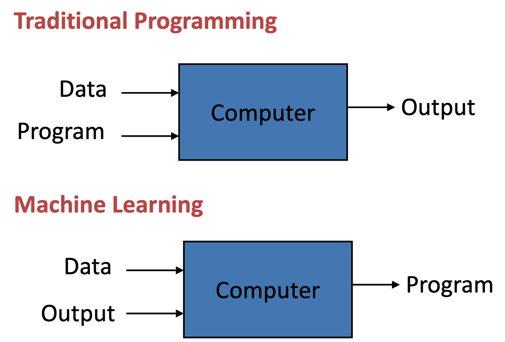
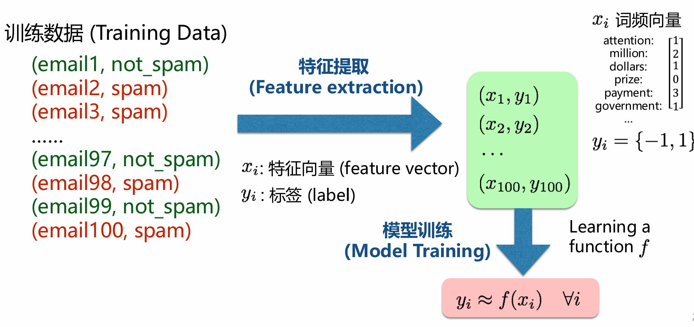
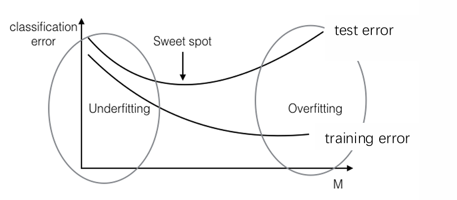
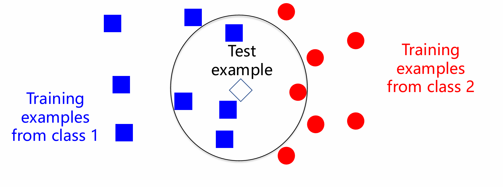

# 人工智能引论 听课笔记

[Introduction to Artificial Intelligence - 2023 Spring - PKU](https://github.com/EmptyBlueBox/Introduction_to_Artificial_Intelligence-llb-2023Spring-PKU)

## 第一节课绪论（2025.02.17）

### 智能体

## 第二节课（2.20）

### ai 数学基础

（以数学基础为主）
目录（图片）
概率论基础
确定性现象和随机现象
概论论：揭示**随机现象统计规律**的数学学科
1.1 样本空间和样本点
样本空间
样本点：样本空间的元素，随机事件E可能出现的结果
空集
1.2 随机事件
随机事件：满足某些条件的样本点组成的集合，是样本空间的子集
以投硬币为例（）
两种特殊的随机事件 必然事件，不可能事件
随机事件的关系
包含关系 事件的并，交，対立事件
互斥事件，对立事件
1.3 古典概型
古典概型：满足两个条件
1.有限样本空间
2.等可能性： 每个试验结果在一次试验中出现的可能性相等
古典概率模型：
不同关系的两个随机事件各自的概率的关系
1.4 条件概率
背景：在事件b已经发生下，事件a发生的概率，记作P(A|B) = P(AB)/P(B)
注意P(AB) =P(A交B)
例题：外出下雨时间
乘法公式：
及其推广
1.5 事件的独立性
相互独立：P(A|B) =P(A) 则称两事件相互独立 推广多个事件相互独立
两两独立：三个事件a,b,c是三个事件，每其中两个都满足相互独立，但三个事件和在一起三个事件不一定是相互独立
很多都是从两个事件推到三个到多个

1.6 全概率公式
完备事件组 :
全概率公式 ：
为什么出现全概率公式，是**由因求果**
1.7 贝叶斯公式
贝叶斯公式分母使用了全概率公式
``
1.8随机变量
``
随机变量
分布函数

## 第三节课

### python 基础

#### Numpy库

## 第九节课  机器学习和线性回归

* time:3月20日

### 机器学习

* 什么是学习
* 什么是机器学习
* 传统编程和机器学习的区别

  
* 机器学习的日常应用

  * 搜索引擎
  * 垃圾邮件分类器
  * 推荐系统
  * 人脸识别
  * 机器翻译
  * 数字助理
  * 交通预测
  * 语音识别
* 机器学习前延应用

  * ALphago
  * 自动驾驶
  * 蛋白质预测

#### 机器学习的类型

* 三种类型的模型
  * 判别式模型(discriminative Models)（需要标签label）
  * 描述式模型(Descriptive Models) (不需要标记)无监督试学习
  * 生成式模型(Generative Models)(不需要标记)无监督试学习
* 两种settings
  * 监督式学习（supervised Learning）
  * 非监督式学习(Unsupervised Learning)
  * **强化学习**:比较特殊的学习的方式 reinforcement learning

本课程主要介绍判别式模型

#### 判别型模型

* 模型（Model）:包含参数的（parameters）的函数* 标签（Lable）:要预测的类别或数值

  

- 模型训练/学习（training /learning）:通过调整模型参数来拟合（fit)训练数据（trainnig data)

##### 两种类型：

1. 分类(classification)：标签是离散的
2. 回归（regression）：标签是连续的

(对一些问题是回归还是分类进行区分)

##### 模型训练过程（Training）

- 输入：x = 邮箱 ，
- 目标：$\text{输出: } y \in \{\text{正常邮件}, \text{垃圾邮件}\}$
- 目标：$\text{fucation}  f(x)=y$

#### 模型评估

* 训练错误(training error)：在训练集上的平均误差
  * **最小化**训练误差来训练模型
  * 对于分类问题中通常用错误率来衡量训练误差
* 测试误差（test error）:在测试集上的平均误差
  * 训练完成后，用来真正衡量模型在新数据上的好坏
  * 衡量模型的泛化（generalization）能力
  * 训练误差低不一定测试误差低——过拟合
* 训练集（training set）、测试集（test set）
  * 对全部的数据，按一定比例随机划分为训练集和测试集
  * 按照时间顺序排序，再将前90%划分为训练集后，后10%测试集
* 过拟合（overfitting）：测试误差远远的大于训练误差
* 欠拟合（underfitting）:训练完成后，训练误差任然很大

#### K近临

* 对于一个最简单的机器学习算法
  * 对于一个测试样本，用训练样本中距离它最近的k个样本中占多数的来预测样本
  * 该图中训练样本中蓝色占多数，所以判定为蓝色

* 优点：

  * 不需要训练
  * 只要一个距离函数即可，默认欧式距离

  $$
  \documentclass{article}
  \usepackage{amsmath}
  \begin{document}
  \[
  \|x_1 - x_2\| = \sqrt{\sum_{j \in [d]} \left(x_1^{(j)} - x_2^{(j)}\right)^2}
  \]
  \end{document}
  $$
* 缺点

  * 需要储存所有的训练样本
  * 在测试时需要计算测试样本到所有训练样本的距离
  * 有时候很难找到一个好的距离函数

##### 纸级灾难(curse of Dimensionality)

有研究怎样将高维降级为低维

* 距离在高维失去意义，不再能很好的衡量远近
* K-NN不适合高维空间

#### 非参数化模型 vs 参数化模型

* 非参数化模型：

  * 例子：knn
  * 模型不能被
    * 1.有限参数(parameter)定义，
    * 2.或不包含参数
  * 需要保留训练数据，以对测试样本做出预测
* 参数化模型

  * 例子：线性回归，神经网络
  * 训练包含课训练的参数，通过拟合训练数据来估计模型参数
  * 训练好模型参数后，可以丢弃训练参数，仅仅依靠模型参数去预测新样本

### 最简单的参数化模型——线性模型

* 线性问题（Liner Model）

  * 线性模型$f(x) = w^Tx +b$
  * 输入$x \in \mathbb{R}^d$
  * 参数$w \in R^d ,b\in R,$分别称为权重(weight)和偏置（bias）
  * 输出$f(x) \in R$
  * 为每一个特证维度学习一个权重，反映其重要性
* 线性回归（Liner Regression）

  * 使用线性模型做回归问题
  * 标签$y \in R$

线性回归例子

* 偏置的作用：提供一个基础的预测值,所有特征在其基础上加权累加

线性回归可视化两个例子

#### 线性回归训练

* 如何训练
  * 通过最小化损失函数
* **平方损失函数（squared loss）**

$$
L(f(x_i),y_i) = (f(x_i)-y_i)^2
$$

* 惩罚那些预测值（prediction）偏离真实值（groundtruth）太大的情况
* 也称做最小二乘法（least squares）
* 求解最优化问题
* 

解决数值问题带来的不稳定的问题

## 第10节课 逻辑回归、多分类与正则化

* 经验分险最小化框架（ERM）

### 二分类问题

#### 逻辑回归

#### 二分类（Binary Classification）

* 标签只有两种

  * $y \in {-1,1}$,-1为负类，1为正类
* 一般不直接让$f(x)\in R$去拟合$y \in {-1,1}$
* 可以采用sign()函数将实数输出转换为{-1，1}、
* 
* 使用什么损失函数

  * 最直接的目标，最小化分类错误数，使用零一损失函数（zero-one loss）
  * 但是，零一损失函数是阶跃函数，不可微且不连续，无法使用梯度最优化
  * 

#### 最大似然框架（Maximum Likehood）

* 使用最大似然估计来推导适合二分类问题的损失函数
* 最大似然估计（MLE）的原则
  * 对机器学习，每个观测数据既是
* 通过最大化观测数据在给定概率下的似然
  * 如果训练样本相互独立(独立分布假设)，最大似然估计可写为
  * $ $
  * 但是，大量概率连乘容易造成数值超出计算精度
  * 解决办法为，最大化对数似然(log-likehood)
    $$

    $$

#### 逻辑回归的最大似然估计

* 首先对$p(y|x;\theta)$建模
  * 对于已有的线性模型$f(x) = w^Tx + b$,只需要吧它转化为正类的概率
  * 采用sigmoid函数$\sigma \colon (-\infty, +\infty) \rightarrow [0,1]$
  * $$
    \begin{align*}
    \sigma(x) &= \frac{1}{1 + e^{-x}} \\
    1 - \sigma(x) &= \frac{e^{-x}}{1 + e^{-x}} = \frac{1}{1 + e^{x}} = \sigma(-x)
    \end{align*}
    $$
  * 则$p(y=1|x;\theta) = p(y=1|x;w,b)=\sigma(f(x))=\sigma(yf(x))$
  * 自然的$p(y= -1|x;w,b) = 1 -\sigma*(f(x))=\sigma(-f(x))=\sigma(yf(x))$
  * 说明，不论y取1/-1都有p(y|x;w,b)=\sigma(yf(x))
* 对

### 多分类问题

#### 采用二分类的思路解决多分类

* 对k分类的问题训练k个二分类器
* 第k个2分类器将k类当做正类，其余类当做负类
* 

#### Softmax回归

* 专门解决多分类问题
* k分类问题$y \in {1,2,K} = [X],x\in [K]$
* 共同训练K个模型
* 将模型输出$f_k(x)$转换为取第k类的概率
  * 不能使用sigmoid函数，因为需满足$$
  * 解决办法：使用softmax函数，使概率归一化
  * $$

    $$

### 正则化(Regularization)

* 目标：避免过拟合
* 实际中我们一般在损失函数后加一项一起优化：

  $$

  $$

  * $\lambda R(X)$称为正则化项，用于惩罚过于复杂的模型
  * $\lambda > 0$是个超参数，余弦指定，不随参数优化
* 为什么需要正则化
  
#### 带正则化的回归

#### 带

